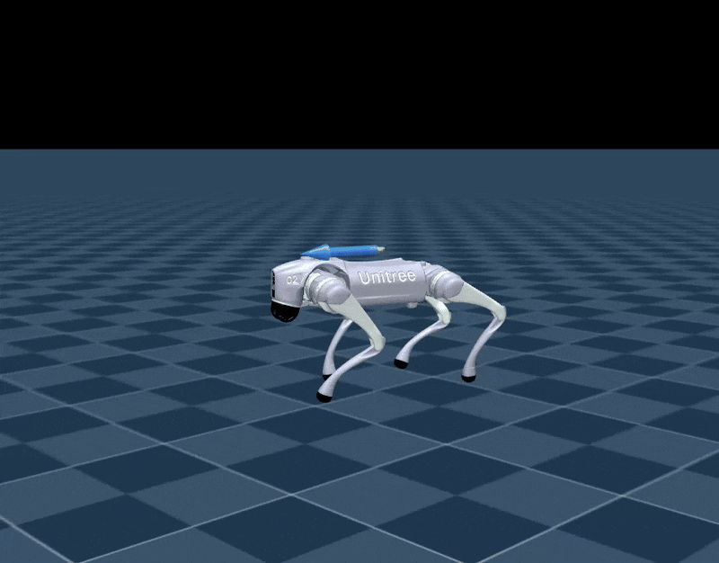
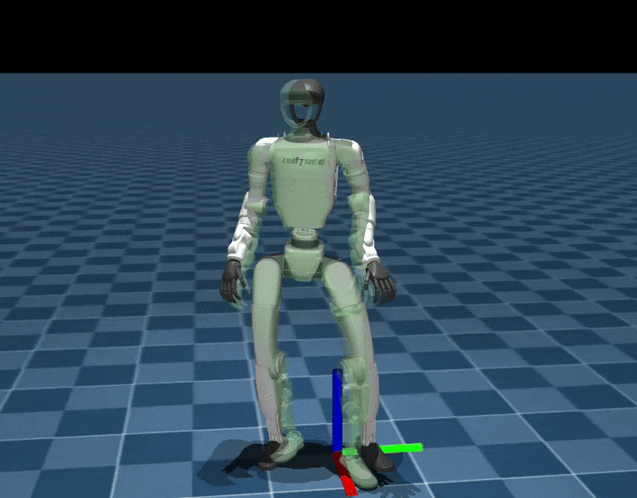
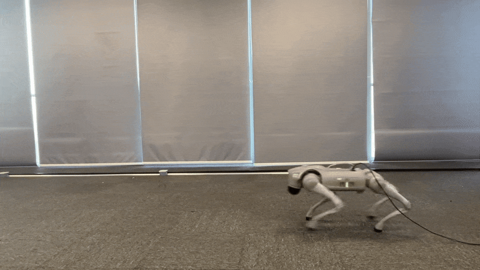
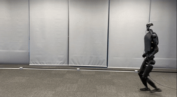

# Unitree RL Mjlab


## ✳️ Overview
Unitree RL Mjlab is a reinforcement learning project built upon the
[mjlab](https://github.com/mujocolab/mjlab.git), using MuJoCo as its 
physics simulation backend, currently supporting Unitree Go2, A2, As2, G1, R1, H1_2 and H2.

Mjlab combines [Isaac Lab](https://github.com/isaac-sim/IsaacLab)'s proven API
with best-in-class [MuJoCo](https://github.com/google-deepmind/mujoco_warp)
physics to provide lightweight, modular abstractions for RL robotics research
and sim-to-real deployment.

<div align="center">

| <div align="center">  MuJoCo </div>                                                                                                                                           | <div align="center"> Physical </div>                                                                                                                                               |
|-------------------------------------------------------------------------------------------------------------------------------------------------------------------------------|------------------------------------------------------------------------------------------------------------------------------------------------------------------------------------|
| <div style="width:250px; height:150px; overflow:hidden;"></div> | <div style="width:250px; height:150px; overflow:hidden;"></div> |

</div>


## 📦 Installation and Configuration

Please refer to [setup.md](doc/setup_en.md) for installation and configuration steps.


## 🔁 Process Overview

The basic workflow for using reinforcement learning to achieve motion control is:

`Train` → `Play` → `Sim2Real`

- **Train**: The agent interacts with the MuJoCo simulation and optimizes policies through reward maximization.
- **Play**: Replay trained policies to verify expected behavior.
- **Sim2Real**: Deploy trained policies to physical Unitree robots for real-world execution.


## 🛠️ Usage Guide

### 1. Velocity Tracking Training

Run the following command to train a velocity tracking policy:

```bash
python scripts/train.py Unitree-G1-Flat --env.scene.num-envs=4096
```

Multi-GPU Training: Scale to multiple GPUs using --gpu-ids:

```bash
python scripts/train.py Unitree-G1-Flat \
  --gpu-ids "[0,1]" \
  --env.scene.num-envs=4096
```

- The first argument (e.g., Mjlab-Velocity-Flat-Unitree-G1) specifies the training task.
Available velocity tracking tasks:
  - Unitree-Go2-Flat
  - Unitree-G1-Flat
  - Unitree-G1-23Dof-Flat
  - Unitree-H1_2-Flat
  - Unitree-A2-Flat
  - Unitree-R1-Flat

> [!NOTE]
> For more details, refer to the mjlab documentation:
> [mjlab documentation](https://mujocolab.github.io/mjlab/index.html).

### 1.1 G1 Anti-Fall Training

The repo now includes a staged **Unitree G1 anti-fall** task family. It keeps the
deployable actor observation contract proprioceptive-only while adding
disturbance-aware critic context, recovery rewards, and benchmark helpers.

Available anti-fall tasks:

- `Unitree-G1-AntiFall-Stage0` — flat standing / walking seed (no external disturbance)
- `Unitree-G1-AntiFall-Stage1` — flat push / kick recovery
- `Unitree-G1-AntiFall-Stage2` — harder flat recovery + near-failure reset starts
- `Unitree-G1-AntiFall-Stage3` — walking-biased flat push / kick recovery
- `Unitree-G1-AntiFall-Stage4a` — off-center / lateral push-kick recovery
- `Unitree-G1-AntiFall-Stage4b` — hardest mixed standing / walking push-kick recovery
- `Unitree-G1-AntiFall-Benchmark` — deterministic benchmark configuration
- `Unitree-G1-AntiFall-Curriculum` — single-entry curriculum task while keeping the stage tasks available for manual debugging / ablations

Recommended curriculum order:

`Stage0 → Stage1 → Stage2 → Stage3 → Stage4a → Stage4b`

Recommended production training command:

```bash
python scripts/train.py Unitree-G1-AntiFall-Curriculum \
  --gpu-ids "[0]" \
  --env.scene.num-envs=4096 \
  --agent.max-iterations=10000 \
  --agent.save-interval=100
```

Parameter guide:

- Positional task argument: the training task ID.
  - Use `Unitree-G1-AntiFall-Curriculum` for the new automatic curriculum entrypoint.
  - Use `Unitree-G1-AntiFall-Stage0` ~ `Unitree-G1-AntiFall-Stage4b` only when you intentionally want a manual single-stage run.
- `--gpu-ids`: GPU selection passed to the training launcher, for example `--gpu-ids "[0]"` for one GPU or `--gpu-ids "[0,1]"` for two GPUs. The legacy spaced form (`--gpu-ids 0 1`) still works.
- `--env.scene.num-envs`: number of parallel environments. Increase it for throughput if your GPU / CPU memory budget allows.
- `--agent.max-iterations`: maximum training iterations.
  - For `Unitree-G1-AntiFall-Curriculum`, this is the **per-stage** iteration budget.
  - For a manual single-stage task, this is the total iteration budget for that run.
- `--agent.save-interval`: checkpoint interval. Training writes `model_*.pt` at this cadence and also exports `policy.onnx`.

Default curriculum behavior:
- The curriculum advances in one top-level process following the fixed stage order above.
- Stage0 promotes on the stable controllable-locomotion gate.
- Stage1 ~ Stage4b promote on recovery-rate / recovery-latency gates.
- If a stage does not meet its gate before `--agent.max-iterations`, the curriculum advances at the per-stage limit.
- the curriculum now keeps a flat push-kick ladder all the way through `Stage4b`, so late-stage promotions do not depend on rough/slip/trip-specific critic changes.

Training outputs are written to:

```text
logs/rsl_rl/g1_antifall/<date_time>_<stage>/...
logs/rsl_rl/g1_antifall_curriculum/<date_time>_curriculum/...
```

> **Migration note:** older checkpoints / manifests created before the push-kick reset may still load,
> but they represent the previous rough/slip/trip-oriented late-stage semantics rather than the
> current mainline ladder.

### 1.2 Replaying a trained G1 anti-fall policy

After `Unitree-G1-AntiFall-Curriculum` finishes, **replay from a stage checkpoint**,
not from the top-level
`logs/rsl_rl/g1_antifall_curriculum/<run>_curriculum/model_*.pt`.

Why:

- `stages/<index>_<stage>/model_*.pt` contains the actual playable policy weights;
- the top-level `model_*.pt` mainly stores curriculum progress metadata;
- the top-level `policy.onnx` is the deployment export, not the input to
  `scripts/play_antifall.py`.

First locate the latest curriculum run:

```bash
LATEST_RUN=$(ls -dt logs/rsl_rl/g1_antifall_curriculum/*_curriculum | head -n1)
ls "$LATEST_RUN/stages"
```

If the curriculum completed, replay the final `Stage4b` policy:

```bash
CKPT=$(ls -t "$LATEST_RUN"/stages/05_stage4b/model_*.pt | head -n1)

python scripts/play_antifall.py \
  --task Unitree-G1-AntiFall-Stage4b \
  --checkpoint-file "$CKPT"
```

If training stopped earlier, use the matching stage directory and task ID:

| Stage directory | Task ID for play |
| --- | --- |
| `stages/00_stage0` | `Unitree-G1-AntiFall-Stage0` |
| `stages/01_stage1` | `Unitree-G1-AntiFall-Stage1` |
| `stages/02_stage2` | `Unitree-G1-AntiFall-Stage2` |
| `stages/03_stage3` | `Unitree-G1-AntiFall-Stage3` |
| `stages/04_stage4a` | `Unitree-G1-AntiFall-Stage4a` |
| `stages/05_stage4b` | `Unitree-G1-AntiFall-Stage4b` |

Useful optional flags:

- `--num-envs 1` to view a single robot;
- `--device cpu` or `--device cuda:0` to select the inference device;
- `scripts/play_antifall.py` always uses the MuJoCo native viewer, so it
  requires a graphical display (`DISPLAY` or `WAYLAND_DISPLAY`).
- `scripts/play_antifall.py` now defaults to native **mouse drag perturbation**:
  click / drag the robot in the MuJoCo viewer to simulate hand-push / foot-kick style disturbances.

If you prefer the generic play entrypoint, you can also run:

```bash
python scripts/play.py Unitree-G1-AntiFall-Stage4b \
  --checkpoint_file="$CKPT" \
  --num_envs=1
```

`scripts/play.py` defaults to `--viewer=auto`: it prefers the native viewer when
a graphical display is available and falls back to the viser viewer otherwise.

For implementation details, stage semantics, and current caveats, see
[`doc/g1_antifall.md`](doc/g1_antifall.md).

### 2. Motion Imitation Training

Train a Unitree G1 to mimic reference motion sequences.

<div style="margin-left: 20px;">

#### 2.1 Prepare Motion Files

Prepare csv motion files in mjlab/motions/g1/ and convert them to npz format:

```bash
python scripts/csv_to_npz.py \
--input-file src/assets/motions/g1/dance1_subject2.csv \
--output-name dance1_subject2.npz \
--input-fps 30 \
--output-fps 50 \
--robot g1 # g1 or g1_23dof
```

**npz files will be stored at:**：`src/motions/g1/...`

#### 2.2 Training

After generating the NPZ file, launch imitation training:

```bash
python scripts/train.py Unitree-G1-Tracking-No-State-Estimation --motion_file=src/assets/motions/g1/dance1_subject2.npz --env.scene.num-envs=4096
```

Available tasks:
  - Unitree-G1-Tracking-No-State-Estimation
  - Unitree-G1-23Dof-Tracking-No-State-Estimation

</div>

> [!NOTE]
> For detailed motion imitation instructions, refer to the BeyondMimic documentation:
> [BeyondMimic documentation](https://github.com/HybridRobotics/whole_body_tracking/blob/main/README.md#motion-preprocessing--registry-setup).

#### ⚙️  Parameter Description
- `--env.scene`: simulation scene configuration (e.g., num_envs, dt, ground type, gravity, disturbances)
- `--env.observations`: observation space configuration (e.g., joint state, IMU, commands, etc.)
- `--env.rewards`: reward terms used for policy optimization
- `--env.commands`: task commands (e.g., velocity, pose, or motion targets)
- `--env.terminations`: termination conditions for each episode
- `--agent.seed`: random seed for reproducibility
- `--agent.resume`: resume from the last saved checkpoint when enabled
- `--agent.policy`: policy network architecture configuration
- `--agent.algorithm`: reinforcement learning algorithm configuration (PPO, hyperparameters, etc.)

**Training results are stored at**：`logs/rsl_rl/<robot>_(velocity | tracking)/<date_time>/model_<iteration>.pt`

### 3. Simulation Validation

To visualize policy behavior in MuJoCo:

Velocity tracking:
```bash
python scripts/play.py Unitree-G1-Flat --checkpoint_file=logs/rsl_rl/g1_velocity/2026-xx-xx_xx-xx-xx/model_xx.pt
```

Motion imitation:
```bash
python scripts/play.py Unitree-G1-Tracking-No-State-Estimation --motion_file=src/assets/motions/g1/dance1_subject2.npz --checkpoint_file=logs/rsl_rl/g1_tracking/2026-xx-xx_xx-xx-xx/model_xx.pt
```

**Note**：

- During training, policy.onnx and policy.onnx.data are also exported for deployment onto physical robots.

**Visualization**：

| Go2                              | G1                             | H1_2                               | G1_mimic                          |
|----------------------------------|--------------------------------|------------------------------------|-----------------------------------|
|  |  |  |  |

### 4. Real Deployment

Before deployment, install the required communication tools:
- [cyclonedds](https://github.com/eclipse-cyclonedds/cyclonedds.git)
- [unitree_sdk2](https://github.com/unitreerobotics/unitree_sdk2.git)

<div style="margin-left: 20px;">

#### 4.1 Power On the Robot
Start the robot in suspended state and wait until it enters `zero-torque` mode.

#### 4.2 Enable Debug Mode
While in `zero-torque` mode, press `L2 + R2` on the controller. The robot will enter `debug mode` with joint damping enabled.

#### 4.3 Connect to the Robot
Connect your PC to the robot via Ethernet. Configure the network as:
- Address：`192.168.123.222`
- Netmask：`255.255.255.0`

Use `ifconfig` to determine the Ethernet device name for deployment.

#### 4.4 Compilation

Example: Unitree G1 velocity control.
Place `policy.onnx` and `policy.onnx.data` into: `deploy/robots/g1/config/policy/velocity/v0/exported`.
Then compile:

```bash
cd deploy/robots/g1
mkdir build && cd build
cmake .. && make
```

#### 4.5 Deployment

## 4.5.1 Simulation Deployment

Before deploying on the real robot, it is recommended to perform simulation deployment using [unitree_mujoco](https://github.com/unitreerobotics/unitree_mujoco)
to prevent abnormal behaviors on the physical robot. This framework has already integrated it.

Build unitree_mujoco：

```bash
cd simulate
mkdir build && cd build
cmake .. && make -j8
```

Launch the simulator (note that a gamepad must be connected):

```bash
./simulate/build/unitree_mujoco
```

You can select the corresponding robot in `simulate/config`

Launch the simulation control program:

```bash
cd deploy/robots/g1/build
./g1_ctrl --network=lo
```

## 4.5.2 Real-Robot Deployment

Launch the control program on the real robot:

```bash
cd deploy/robots/g1/build
./g1_ctrl --network=enp5s0
```

**Arguments**：
- `network`: The network interface used to connect to the robot. Use `lo` for simulation deployment, and `enp5s0` for the real robot(You can check it using the `ifconfig` command) 

</div>

**Deployment Results**：

| Go2                                                    | G1                                                    | H1_2           | G1_mimic                                           |
|--------------------------------------------------------|-------------------------------------------------------|----------------|----------------------------------------------------|
|  |  |  |  |


## 🎉  Acknowledgements

This project would not be possible without the contributions of the following repositories:

- [mjlab](https://github.com/mujocolab/mjlab.git): training and execution framework
- [whole_body_tracking](https://github.com/HybridRobotics/whole_body_tracking.git): versatile humanoid motion tracking framework
- [rsl_rl](https://github.com/leggedrobotics/rsl_rl.git): reinforcement learning algorithm implementation
- [mujoco_warp](https://github.com/google-deepmind/mujoco_warp.git): GPU-accelerated rendering and simulation interface
- [mujoco](https://github.com/google-deepmind/mujoco.git): high-fidelity rigid-body physics engine
