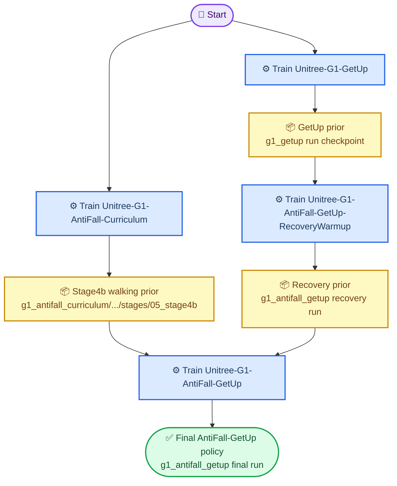

<h1 align="center">Unitree RL MJLab: Train → Play → Sim2Real</h1>

<p align="center">
  <a href="README.md">English</a> · <a href="README_zh.md">中文</a>
</p>

This repository is based on **Unitree RL MJLab / mjlab** and keeps the original
MuJoCo-centered training and deployment workflow.  On top of the base Unitree
locomotion examples, this fork adds dedicated **G1 Parkour**, **G1 AntiFall**,
and **G1 GetUp** modules, plus simulator/deployment glue for running exported
policies in Unitree-style C++/DDS control loops.

The intended workflow is:

```text
1. Train      -> learn or adapt a policy in MJLab/MuJoCo
2. Play       -> replay and inspect the policy in Python/MuJoCo
3. Sim2Real   -> validate through Unitree simulator/C++ controller before robot use
```

## Repository layout

```text
.
├── src/
│   ├── tasks/velocity/config/        # MJLab task registration and environment configuration.
│   ├── tasks/velocity/mdp/           # Reward, reset, event, and observation helper logic.
│   └── parkour/                      # Parkour ONNX/deploy contracts, observation adapter, depth utilities, and scene editor core.
├── scripts/
│   ├── train.py                      # Generic training entrypoint.
│   ├── play.py                       # Generic Python policy replay / visualization entrypoint.
│   ├── play_parkour.py               # Depth-conditioned G1 Parkour replay and diagnostics.
│   ├── play_antifall.py              # G1 AntiFall replay with native MuJoCo drag perturbations.
│   ├── train_getup.py                # GetUp training wrapper with terrain selection.
│   ├── play_getup.py                 # GetUp play wrapper with terrain selection.
│   ├── train_getup_amp.py            # Optional ground-only GetUp AMP/demo-data fallback training wrapper.
│   ├── prepare_g1_getup_amp_data.py  # YAML-driven GetUp demo-data conversion.
│   ├── play_g1_getup_amp_data.py     # G1 MuJoCo playback for converted GetUp demo clips.
│   └── edit_parkour_scene.py         # Browser-based Viser editor for parkour terrain boxes.
├── data/
│   └── g1_getup_amp.yaml             # Local GetUp demo-data workflow config for selected .pkl/.npz clips.
├── deploy/
│   └── robots/g1_parkour/            # C++/DDS G1 Parkour controller and policy runtime.
├── simulate/                         # Unitree MuJoCo simulator integration and configuration.
└── doc/                              # Human-facing documentation for setup, modules, and sim2real notes.
```

## Environment setup

Recommended host:

- Ubuntu 22.04
- NVIDIA GPU for high-throughput training
- NVIDIA driver 550+ when using CUDA/MuJoCo rendering
- Python 3.11

Create and activate an environment:

```bash
conda create -n unitree_rl_mjlab python=3.11 -y
conda activate unitree_rl_mjlab
```

Install system packages used by the C++ simulator/deploy side:

```bash
sudo apt update
sudo apt install -y \
  build-essential cmake git \
  libyaml-cpp-dev libboost-all-dev libeigen3-dev libspdlog-dev libfmt-dev
```

Install the Python package:

```bash
git clone https://github.com/sjtumrgx/unitree_rl_mjlab.git
cd unitree_rl_mjlab
pip install -e .
```

`setup.py` pins the core MJLab dependencies (`mjlab==1.2.0`,
`mujoco-warp==3.5.0`).  If native viewers or depth windows fail to open on a
headless machine, run with `--viewer none --no-depth-viewer`, or set the proper
`DISPLAY` / `WAYLAND_DISPLAY` / `MUJOCO_GL` variables for your display stack.

## 1. Train

All training examples below explicitly include:

- `--gpu-ids "[0]"` to select GPU 0
- `--env.scene.num-envs=4096` to set the parallel environment count
- `--agent.max-iterations=...` or wrapper `--max-iterations ...` to set the training budget

### 1.1 Base velocity policies

Use the generic training script and pass the task id as the first argument:

```bash
python scripts/train.py Unitree-G1-Flat \
  --gpu-ids "[0]" \
  --env.scene.num-envs=4096 \
  --agent.max-iterations=10001
```

Common flat velocity tasks include:

- `Unitree-Go2-Flat`
- `Unitree-G1-Flat`
- `Unitree-G1-23Dof-Flat`
- `Unitree-H1_2-Flat`
- `Unitree-A2-Flat`
- `Unitree-R1-Flat`

Useful runtime flags:

```bash
# Change GPU id, environment count, or runner budget through dotted config keys.
python scripts/train.py Unitree-G1-Flat \
  --gpu-ids "[1]" \
  --env.scene.num-envs=2048 \
  --agent.max-iterations=3000
```

Training logs are written under `logs/rsl_rl/<experiment>/<run>/`.

### 1.2 G1 AntiFall

AntiFall adds a staged disturbance-recovery curriculum for G1.  It preserves the
blind/proprioceptive actor contract, but trains progressively harder recovery
behavior:

| Task | Use |
| --- | --- |
| `Unitree-G1-AntiFall-Stage0` | Flat standing/walking seed. |
| `Unitree-G1-AntiFall-Stage1` | Flat push/kick recovery. |
| `Unitree-G1-AntiFall-Stage2` | Harder recovery with near-failure reset starts. |
| `Unitree-G1-AntiFall-Stage3` | Walking-biased push/kick recovery. |
| `Unitree-G1-AntiFall-Stage4a` | Off-center/lateral disturbance recovery. |
| `Unitree-G1-AntiFall-Stage4b` | Hardest mixed standing/walking disturbance task. |
| `Unitree-G1-AntiFall-Curriculum` | Recommended automatic curriculum entrypoint. |
| `Unitree-G1-AntiFall-Benchmark` | Deterministic evaluation configuration. |

Recommended training entrypoint:

```bash
python scripts/train.py Unitree-G1-AntiFall-Curriculum \
  --gpu-ids "[0]" \
  --env.scene.num-envs=4096 \
  --agent.max-iterations=10000
```

For curriculum runs, `agent.max-iterations` is the per-stage budget.  Stage
checkpoints are written below:

```text
logs/rsl_rl/g1_antifall_curriculum/<run>_curriculum/stages/<stage>/model_*.pt
```

The top-level exported ONNX/policy artifacts are for deployment; use stage
checkpoints for Python replay.  Path roots follow the runner configs:
curriculum checkpoints use `logs/rsl_rl/g1_antifall_curriculum`, and standalone
AntiFall stage tasks use `logs/rsl_rl/g1_antifall`.


### 1.3 G1 GetUp

GetUp ports HoST-style terrain variants into an MJLab task.  The wrapper
supports `mixed`, `ground`, `platform`, `wall`, and `slope`; `mixed` is the
single-policy training entrypoint for terrain transfer:

```bash
python scripts/train_getup.py --terrain mixed -- \
  --gpu-ids "[0]" \
  --env.scene.num-envs=4096 \
  --agent.max-iterations=10001

# Optional single-terrain specialization or ablation.
python scripts/train_getup.py --terrain ground -- \
  --gpu-ids "[0]" \
  --env.scene.num-envs=4096 \
  --agent.max-iterations=10001
```

Equivalent generic form:

```bash
python scripts/train.py Unitree-G1-GetUp \
  --getup-terrain=mixed \
  --gpu-ids "[0]" \
  --env.scene.num-envs=4096 \
  --agent.max-iterations=10001
```

The terrain flag controls reset poses, terrain distribution, assist-force
settings, and RL run naming.  Use `mixed` when the same policy should cover all
GetUp terrain variants; use a single terrain only for targeted debugging or
ablation.

Optional AMP/demo-data fallback, kept separate from the default no-demo task:

```bash
python scripts/prepare_g1_getup_amp_data.py
python scripts/play_g1_getup_amp_data.py --validate-only

python scripts/train_getup_amp.py \
  --num-envs 4096 \
  --max-iterations 10001 \
  --warm-start-checkpoint logs/rsl_rl/g1_getup/<getup_run>/model_*.pt \
  -- --gpu-ids "[0]"
```

Before AMP training, configure local `.pkl` source clips, playback `.npz` files,
and final training `.npz` files in `data/g1_getup_amp.yaml`.  The workflow is:
prepare selected local `.pkl` clips into `data/motions/g1_getup_amp/motions/*.npz`,
play the converted data on the checked-in G1 MuJoCo model, then train only with
the confirmed clips listed under `train.npz_files`.  See
`doc/g1_getup_demo_data.md` for the detailed post-download workflow.

### 1.4 G1 AntiFall-GetUp

AntiFall-GetUp combines the Stage4b walking prior with a fallen-start GetUp
recovery prior.  The default dependency graph is: train the AntiFall curriculum
and GetUp priors first, use the GetUp checkpoint to train the AntiFall-GetUp
RecoveryWarmup checkpoint, then fuse the curriculum Stage4b checkpoint and the
RecoveryWarmup checkpoint into the final dual-branch policy.  Both the
RecoveryWarmup and final AntiFall-GetUp runs write under
`logs/rsl_rl/g1_antifall_getup`:



```bash
# 1) Fallen-start recovery warmup in the final AntiFall-GetUp tensor contract.
python scripts/train.py Unitree-G1-AntiFall-GetUp-RecoveryWarmup \
  --gpu-ids "[1]" \
  --resume-checkpoint-path logs/rsl_rl/g1_getup/<getup_run>/model_*.pt \
  --actor-only-resume True \
  --agent.resume True \
  --env.scene.num-envs=4096 \
  --agent.max-iterations=1000 \
  --agent.run-name recovery_warmup

# 2) Fuse a walking AntiFall prior with the recovery prior and fine-tune.
#    Use the curriculum Stage4b checkpoint by default; if Stage4b was trained
#    directly, use logs/rsl_rl/g1_antifall/<stage4b_run>/model_*.pt instead.
python scripts/train.py Unitree-G1-AntiFall-GetUp \
  --gpu-ids "[2]" \
  --resume-checkpoint-path logs/rsl_rl/g1_antifall_curriculum/<run>_curriculum/stages/05_stage4b/model_*.pt \
  --recovery-resume-checkpoint-path logs/rsl_rl/g1_antifall_getup/<recovery_run>/model_*.pt \
  --actor-only-resume True \
  --agent.resume True \
  --env.scene.num-envs=4096 \
  --agent.max-iterations=1000 \
  --agent.run-name antifall_getup
```

Use `--policy-only-resume True` only when continuing from an already fused
AntiFall-GetUp checkpoint and you want to keep actor/critic weights while
resetting optimizer state.

### 1.5 G1 Parkour artifacts

The current Parkour lane is primarily a **play/deploy lane** for an exported
InstinctLab-style depth-conditioned policy.  Policy bundle defaults live under:

```text
deploy/robots/g1_parkour/config/policy/parkour/v0/
```

If you promote a new trained artifact bundle, keep `actor.onnx`,
`0-depth_encoder.onnx`, `params/deploy.yaml`, and `parkour_artifacts.json`
together.  The deploy YAML defines joint order, action scale, depth crop, depth
range, and camera contract used by both Python and C++ runtimes.

## 2. Play

Play is where most transfer bugs should be found before C++/DDS or real robot
runs.  Always verify joint order, action order, command convention, reset pose,
and viewer/depth diagnostics here first.

### 2.1 Generic play

```bash
python scripts/play.py Unitree-G1-Flat \
  --checkpoint-file logs/rsl_rl/g1_velocity/<run>/model_*.pt
```

Use `--viewer native` when you need MuJoCo mouse/keyboard interaction.  Use
`--viewer none` for headless validation.

### 2.2 AntiFall play

Replay a stage checkpoint with the native MuJoCo viewer:

```bash
python scripts/play_antifall.py \
  --task Unitree-G1-AntiFall-Stage4b \
  --checkpoint-file logs/rsl_rl/g1_antifall_curriculum/<run>_curriculum/stages/05_stage4b/model_*.pt \
  --num-envs 1 \
  --device cuda:0
```

If you trained `Unitree-G1-AntiFall-Stage4b` directly, use
`logs/rsl_rl/g1_antifall/<stage4b_run>/model_*.pt` instead.


### 2.3 AntiFall-GetUp play

AntiFall-GetUp is a separate registered task, so use the generic play
entrypoint:

```bash
python scripts/play.py Unitree-G1-AntiFall-GetUp \
  --checkpoint-file logs/rsl_rl/g1_antifall_getup/<run>/model_*.pt \
  --num-envs 1 \
  --viewer native \
  --no-terminations
```

The native MuJoCo viewer supports drag perturbations.  Drag the robot body to
apply interactive pushes/kicks; use this to check recovery behavior before any
hardware run.

### 2.4 GetUp play

```bash
python scripts/play_getup.py --terrain ground -- \
  --checkpoint-file logs/rsl_rl/g1_getup/<run>/model_*.pt \
  --num-envs 1 \
  --viewer native

# Re-run with platform, wall, and slope to check terrain transfer.
python scripts/play_getup.py --terrain slope -- \
  --checkpoint-file logs/rsl_rl/g1_getup/<run>/model_*.pt \
  --num-envs 1 \
  --viewer native
```

For a `mixed` GetUp policy, replay the same checkpoint across `ground`,
`platform`, `wall`, and `slope`.  For single-terrain runs, keep the play terrain
matched unless you are intentionally testing transfer.

AMP fallback play uses the generic play entrypoint:

```bash
python scripts/play.py Unitree-G1-GetUp-AMP \
  --checkpoint-file logs/rsl_rl/g1_getup_amp/<run>/model_*.pt \
  --num-envs 1 \
  --viewer native
```

To inspect the demonstration motion itself before training, replay the prepared
retargeted clip directly on the G1 MuJoCo model:

```bash
python scripts/play_g1_getup_amp_data.py \
  --motion-index 0 \
  --speed 1.0
```

Use `--play-all` to step through every accepted clip, or `--validate-only` for a
headless kinematic check.

For Unitree simulator / C++ controller validation, copy the exported
`logs/rsl_rl/g1_getup_amp/<run>/policy.onnx` into
`deploy/robots/g1_getup/config/policy/getup/v0/exported/policy.onnx`, then use
the existing GetUp controller build/run flow.

### 2.5 Parkour play and terrain editing

Default Parkour replay:

```bash
python scripts/play_parkour.py
```

Headless validation:

```bash
python scripts/play_parkour.py --validate-walk \
  --viewer none \
  --no-depth-viewer \
  --max-steps 20
```

The default command mode is `terrain-route`: the script reads
`g1_parkour_route_waypoints` from the task config and generates velocity commands
that follow the deterministic terrain sequence.  Use `--command-mode fixed` only
when you intentionally want a fixed body command ablation.

The parkour terrain source of truth is now:

```text
src/assets/robots/unitree_g1/xmls/scene_g1_parkour.xml
```

Open the visual terrain editor:

```bash
python scripts/edit_parkour_scene.py --open-browser
```

The editor exposes each terrain box module with intuitive **full** length/width
/height values.  MuJoCo XML stores box `size` as half-extents, so a displayed
`0.36 x 1.44 x 0.04 m` box is written as `size="0.18 0.72 0.02"`.  If you change
obstacle order or total course length, update the route waypoints separately in
`src/tasks/velocity/config/g1_parkour/env_cfgs.py`.

## 3. Sim2Real

Sim2Real means moving from Python/MJLab replay to the Unitree C++/DDS control
stack, first in simulator and only then on hardware.  Treat every task as its
own lane: the simulator is shared, but the controller binary, policy directory,
keyboard transition, and safety gate differ by module.

### 3.1 Common simulator build

Build the Unitree MuJoCo simulator once:

```bash
cmake -S simulate -B simulate/build
cmake --build simulate/build -j4
```

The normal simulator binary reads `simulate/config.yaml`; the Parkour binary
reads `simulate/config_parkour.yaml` and enables the depth bridge by default.

### 3.2 Task-specific loopback commands

Use two terminals for loopback: start the simulator first, then start the matching
controller with `--network=lo`.  For real hardware, keep the same controller but
replace `lo` with the robot network interface after simulator validation passes.

| Task | Python gate before C++ | Controller build | Loopback simulator terminal | Loopback controller terminal | Enter/control | Main caveat |
| --- | --- | --- | --- | --- | --- | --- |
| Velocity / base G1 | `python scripts/play.py Unitree-G1-Flat --checkpoint_file <model.pt>` | `cmake -S deploy/robots/g1 -B deploy/robots/g1/build`<br>`cmake --build deploy/robots/g1/build -j4` | `./simulate/build/unitree_mujoco` | `./deploy/robots/g1/build/g1_ctrl --network=lo --keyboard` | keyboard: `f` → `v`; joystick: `L2+Up` → `R2+A` | The deployed artifact is read from `deploy/robots/g1/config/policy/velocity/v0`; verify joint order/action scale in `params/deploy.yaml`. |
| AntiFall | `python scripts/play_antifall.py --task Unitree-G1-AntiFall-Stage4b --run-dir <stage_dir> --checkpoint <model.pt>` | `cmake -S deploy/robots/g1_antifall -B deploy/robots/g1_antifall/build`<br>`cmake --build deploy/robots/g1_antifall/build -j4` | `./simulate/build/unitree_mujoco` | `./deploy/robots/g1_antifall/build/g1_antifall_ctrl --network=lo --keyboard` | keyboard: `f` → `v`; joystick: `L2+Up` → `R2+A` | Validate recovery with simulator pushes before hardware; do not use AntiFall to mask wrong action order, PD gains, or reset pose. |
| GetUp | `python scripts/play_getup.py --terrain ground -- --checkpoint_file <model.pt>` | `cmake -S deploy/robots/g1_getup -B deploy/robots/g1_getup/build`<br>`cmake --build deploy/robots/g1_getup/build -j4` | `./simulate/build/unitree_mujoco` | `./deploy/robots/g1_getup/build/g1_getup_ctrl --network=lo --keyboard` | keyboard: `f` → `g`; joystick: `L2+Up` → `R2+Y` | Start with ground get-up.  Platform/wall/slope hardware tests need matched start geometry and extra physical support. |
| Parkour | `python scripts/play_parkour.py --check-contract --viewer none --no-depth-viewer`<br>`python scripts/play_parkour.py --validate-walk --viewer none --no-depth-viewer --max-steps 20` | `cmake -S deploy/robots/g1_parkour -B deploy/robots/g1_parkour/build`<br>`cmake --build deploy/robots/g1_parkour/build -j4` | `./simulate/build/unitree_mujoco_parkour` | `./deploy/robots/g1_parkour/build/g1_parkour_ctrl --network=lo`<br>or auto-start: `./deploy/robots/g1_parkour/build/g1_parkour_ctrl --network=lo --sim-autostart-parkour` | loopback keyboard route: hold `w` / `up`; `p` returns Passive | Live depth is part of the policy contract.  Constant depth is only an ablation, not terrain traversal proof. |

For headless simulator diagnostics, add `--headless --headless-seconds <N>` to
the simulator command.  For Parkour depth ablations, set
`G1_PARKOUR_DEBUG_CONSTANT_DEPTH=0.5` on the controller, or start the simulator
with `G1_PARKOUR_DEPTH_BRIDGE=0` to disable simulator-side live depth publishing.

### 3.3 Real robot checklist

Before hardware:

1. Verify Python `play` behavior with the same checkpoint/artifact.
2. Verify the task-specific simulator loopback row above with conservative
   commands.
3. Confirm joint names, action scale, default joint pose, and policy observation
   order match the deploy YAML.
4. Confirm robot network interface and DDS domain do not collide with another
   simulator/controller process.
5. Replace `--network=lo` with the robot NIC only after simulator validation.
6. Start with low speed and a safety operator ready to switch to Passive.
7. Keep the robot suspended or supported for the first motor-enable test when
   changing action order, PD gains, or default pose.
8. Do not tune away instability by blindly increasing stiffness; first check
   command frame, action order, torque limits, depth validity, and reset pose.

Common Parkour-specific caveats:

- Depth input is part of the policy contract.  Constant depth is useful for
  ablation, but it is not a terrain traversal validation.
- The torso-mounted `parkour_depth_camera` crop/range/history must match
  `deploy.yaml`.
- The Python route follower and C++ loopback commands can differ if route
  waypoints are changed without updating both sides.
- `scene_g1_parkour.xml` edits affect Python play because the MJLab debug spec
  reads terrain modules from that XML.

## Additional documentation

- `doc/setup_en.md` / `doc/setup_zh.md` — environment setup.
- `doc/train_play_sim2real_en.md` / `doc/train_play_sim2real_zh.md` — end-to-end workflow checklist.
- `doc/g1_antifall.md` — AntiFall train/play/sim2real notes.
- `doc/g1_parkour.md` — Parkour artifact, depth, terrain, and deploy notes.
- `doc/g1_getup_demo_data.md` — optional GetUp AMP/demo-data fallback and source-gate workflow.
- `doc/g1_getup.md` — GetUp terrain migration and usage notes.

## Acknowledgements

This work builds on Unitree RL MJLab, MJLab, MuJoCo, MuJoCo Warp, RSL-RL,
Unitree SDK2, and Unitree MuJoCo.  This fork adds the G1 Parkour, AntiFall, and
GetUp workflows and related deployment utilities.
